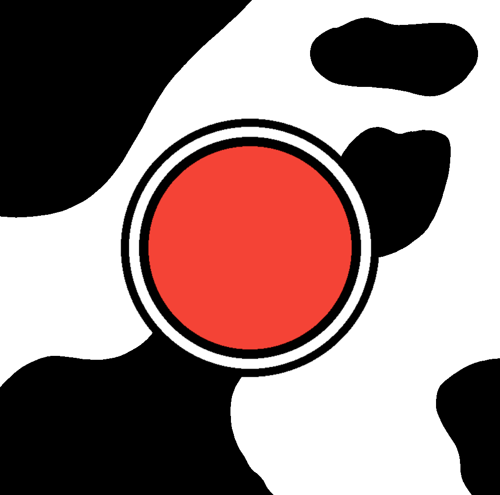

<h1>  
  CitizenScienceBovineGenetics
</h1>

> [!NOTE]
> This app is still under develoupment and is not yet released to the app store
> or play store. We hope it will become available before the end of summer 2025.

An app created for citizens to participate in dairy science research. 

## Associations

This app was created for use by the University of Minnesota.

## Objectives
1. To collect data for scientific research
2. To have users participate in research
